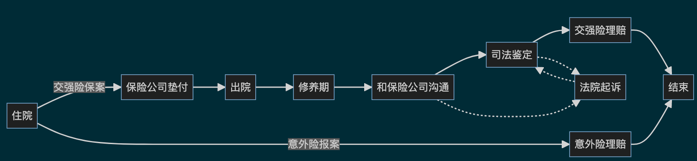
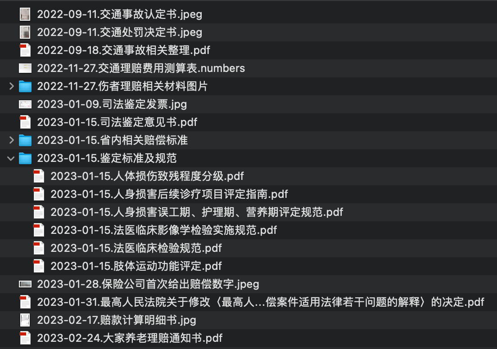
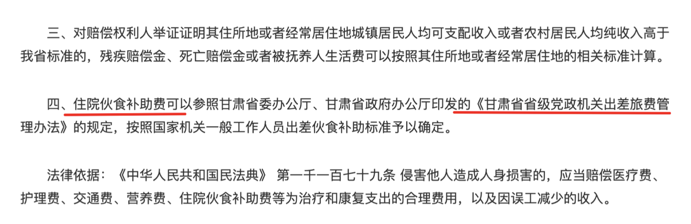

public:: true
title:: 2023-02-25.记录最近的保险理赔经历

- ## 背景介绍
  去年家里人由于意外出了交通事故，从住院做手术到最近走完所有的程序花了大概半年时间。这里面设计到交强险，司法鉴定，意外险理赔等。我也是第一次经历这些东西。所以简单写个文章记录梳理一下整个过程，当作一个整理和事后总结和回顾的过程。
-
- ## 时间线
  对于人身伤害这类的事件，从住院手术到保险理赔整体周期比较长。按照时间线梳理如下图所示，虚线法院起诉的环节也是一种可选项，自己并没有经历，学学法律了以后有其它机会的话可以去体检一下。这个流程里面对时间比较重要的就是报案了，在事故发生后应该尽快报案。
  
- 整个流程里面设计到的一些相关的文档如下图所示，相关文件还是挺多的。
  
-
- ## 具体细节
- 在事故发生之后，开始网上查找和交通事故相关的信息，网上的信息比较零碎，感觉把有用的截图整理下来，主要是大概了解处理的流程，和大概设计到要和哪些人打交道。
-
- 接下来花了很多时间来学习交强险的理赔相关，交强险的赔付主要有人伤和财产损失两块，对方买的保险是用来赔偿你的损失，你也要赔偿对方的损失这样。
  
  这里面人身伤害的赔偿涉及的项目比较多，有医药费，误工费，护理费，营养费，交通费，住院伙食补助费等，因为设计到具体的数字，每一个项目就需搞清楚到底怎么赔付的。好在国家对这些东西都是有详细规定的，只要能找到对应的文件，自己就能基本算的清楚。
  
  举个例子，对于伙食补助费，我家所在的省就有明确说明，只要找到对应的文件看看数字，乘以对应的天数，就很好算出来了
  
  
  当然这里面需要赔偿的大头是误工费，算法是上一年度各对应职业的平均工资 x 天数，上一年的平均工资这些数据，省里也是每年都发文件的，一搜索就找到了。
  
  按照这些方法，我在很早的时候就整理出来了一个表格，里面有每一项需要赔偿的大概的数字和对应的具体的法律规定，到最后理赔的时候和保险公司给出的数字大差不差，保险小哥甚至问我是不是找了专业的律师。
-
- 然后涉及到的一个流程是司法鉴定，这个流程不是必须的，只要和保险公司能达成一致。司法鉴定所是司法部认定持有专门资格证的人组织起来的单位，提供司法鉴定服务。
  
  我们平常所说的伤残几级就是他们来评定的，国家有**人体损伤致残程度分级**这样一个文件，里面分门别类的列出了相应的标准，看起来比较直白简单，里面有许多定量的数字，比如什么地方损坏大于40%是2级，低于是1级。这里的40%要怎么确定就是个问题，当然国家对这些东西都是有明确测量方法的，在**鉴定保准及规范里面**有几个文件都是这个相关的，简单看了一下，也举个简单例子，比如一个人胳膊骨折了，右胳膊能完全伸展到90度，左胳膊只能伸到30度，那损坏就是60%。
  
  司法鉴定就是找这样的机构来对人体伤害按照国家规定做相关的测量，最终给出一个定级，以及需要的误工和营养天数等。出乎意料的是他们的收费比较高。
-
- 最后在简单写一下意外险的理赔，去年给家人买了大家养老的小蜜蜂2号意外险基础款。因为报案非常早，中间他们的理赔人员打了好几次电话来询问进展，保单今年初就过期了，直到最近才理赔成功。感觉他们那边服务还是挺好的，后悔没有买个带医疗津贴的。
  
-
-
- ## 一些反思
- 各种法律规定条文也没有那么难看懂，耐心细看也能看的懂，难的地方可能是比较杂，新旧版本和各种补充规定比较多，需要仔细搜索和查找。
- 理赔过程需要提交一些文档，医院相关的和个人相关的，身份证银行卡之类的，这些文件都很常用，可以平时就把这些文件整理好存成图片，用的时候直接拿来用就好了。省的每次都去重新找。
- 免不了和各种人沟通，对一些号码做个备注，避免用微信，对关键的沟通录音，便于后面查找
-
- ##